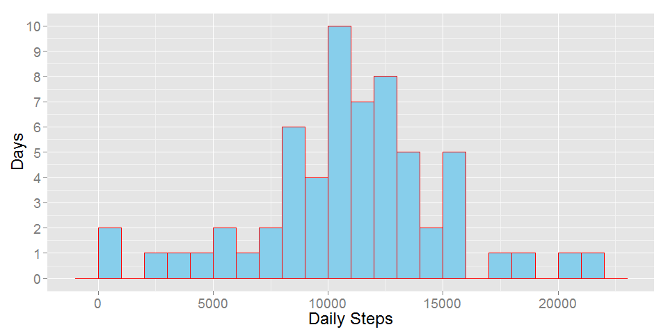
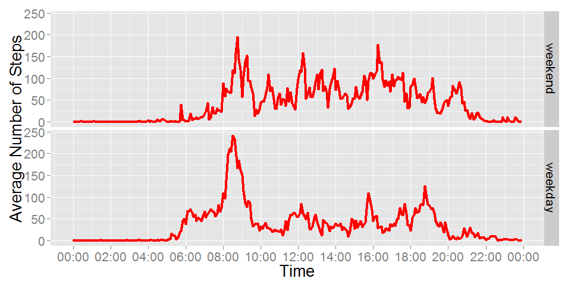

# Reproducible Research: Peer Assessment 1


## Loading and preprocessing the data

### load R libraries

```r
library(data.table)
library(ggplot2)
library(scales)
library(knitr)
```

```
## Warning: package 'knitr' was built under R version 3.2.3
```

```r
library(timeDate)
```

```
## Warning: package 'timeDate' was built under R version 3.2.3
```

```r
library(dplyr)
```

```
## 
## Attaching package: 'dplyr'
```

```
## The following objects are masked from 'package:data.table':
## 
##     between, last
```

```
## The following objects are masked from 'package:stats':
## 
##     filter, lag
```

```
## The following objects are masked from 'package:base':
## 
##     intersect, setdiff, setequal, union
```

```r
library(mice)
```

```
## Warning: package 'mice' was built under R version 3.2.3
```

```
## Loading required package: Rcpp
```

```
## mice 2.25 2015-11-09
```

Set global options for R code chunks

```r
opts_chunk$set(fig.width=10)
```

**1.** Read data

```r
data <- fread('activity.csv', na.strings="NA")
```

**2.** Change int to time format

```r
t <- sprintf("%04d", data$interval)
```

Change string to date format

```r
data$dt <- as.POSIXct(paste(data$date,t), "%Y-%m-%d %H%M", tz="GMT")
```

create time column

```r
data$t <- as.POSIXct(t, "%H%M", tz="GMT")
```

## What is mean total number of steps taken per day?

**1.** Split, apply, combine

```r
df = data %>% group_by(date) %>% summarise(dailySteps = sum(steps, na.rm=TRUE))
```

**2.** Plot histogram

```r
ggplot(df,aes(dailySteps)) +
    geom_histogram(binwidth=1000, fill=('orange'), col=('black')) +
    scale_y_continuous(breaks=seq(0,15)) +
    theme(text=element_text(size=18)) +
    xlab('Daily Steps') +
    ylab('Days')
```


**3.** mean number of steps per day

```r
mean(df$dailySteps, na.rm=TRUE)
```

```
## [1] 9354.23
```

median number of steps per day

```r
median(df$dailySteps, na.rm=TRUE)
```

```
## [1] 10395
```

## What is the average daily activity pattern?

**1.** Split, apply, combine and plot

```r
df2 = data %>% group_by(t) %>% summarise(avgSteps = mean(steps, na.rm=TRUE))

ggplot(df2,aes(t, avgSteps)) +
    geom_line(col='blue') +
    geom_point(size=2.5, col='black') +
    scale_x_datetime(labels = date_format("%H:%M"),breaks = "2 hour") +
    xlab('Time') +
    ylab('Average Number of Steps') +
    theme(text=element_text(size=20))
```


**2.** Time of max steps (ignore date)

```r
max_steps = max(df2$avgSteps)
df2[df2$avgSteps == max_steps,t]
```

```
## [1] "2016-02-21 08:35:00 GMT"
```

## Imputing missing values

**1.** number of rows that have NAs

```r
nrow(data) - sum(complete.cases(data))
```

```
## [1] 2304
```

**2.** impute step values based on interval column

```r
pMatrix <- matrix(0, 5, 5)
pMatrix[1,3] = 1
```
impute missing values

```r
imp <- mice(data, m=4, maxit=3, predictorMatrix=pMatrix, seed=2016)
```

**3.** fill in the 4th imputation

```r
completedData <- complete(imp,4)
```

**4.** Split, apply, combine and plot histogram

```r
df3 = completedData %>% group_by(date) %>% summarise(dailySteps = sum(steps))
ggplot(df3,aes(dailySteps)) +
    geom_histogram(binwidth=1000, fill=('skyblue'), col=('red')) +
    scale_y_continuous(breaks=seq(0,15)) +
    theme(text=element_text(size=18)) +
    xlab('Daily Steps') +
    ylab('Days')
```



mean number of steps per day

```r
mean(df3$dailySteps)
```

```
## [1] 10923.77
```

median number of steps per day

```r
median(df3$dailySteps)
```

```
## [1] 11015
```

Mean and median values for completed dataset are higher than those with NAs. The total daily number of steps has increased as expected.

## Are there differences in activity patterns between weekdays and weekends?

**1.** create factor variable for weekday


```r
completedData$day = factor(isWeekday(completedData$dt, wday=1:5), labels=c('weekend', 'weekday'))
```

**2.** Split, apply, combine and plot facets

```r
df4 = completedData %>% group_by(day,t) %>% summarise(avgSteps = mean(steps))

ggplot(df4,aes(t, avgSteps)) +
    geom_line(size=1.5, col='red') +
    scale_x_datetime(labels = date_format("%H:%M"),breaks = "2 hour") +
    xlab('Time') +
    ylab('Average Number of Steps') +
    facet_grid(day~.) + 
    theme(text=element_text(size=20))
```


